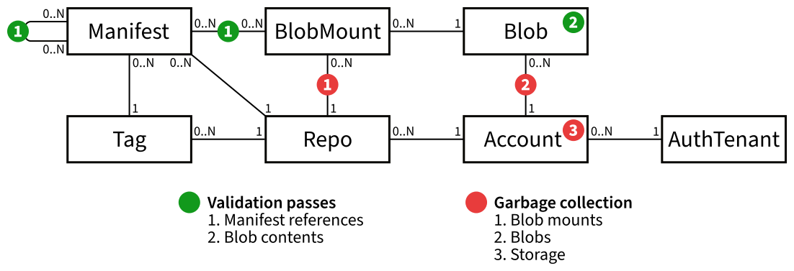

# Keppel Operator Guide

In this document:

- [Terminology and data model](#terminology-and-data-model)
  - [Validation and garbage collection](#validation-and-garbage-collection)
- [Building and running Keppel](#building-and-running-keppel)
  - [Drivers](#drivers)
  - [Common configuration options](#common-configuration-options)
  - [API server configuration options](#api-server-configuration-options)
  - [Janitor configuration options](#janitor-configuration-options)
- [Prometheus metrics](#prometheus-metrics)

In other documents:

- [Supported drivers](./drivers/)

## Terminology and data model

This document assumes that you have already read and understood the [general README](../README.md). If not, start
reading there.

As outlined in the general README, Keppel stores data in **accounts** (each of which is tied to exactly one backing
storage) that are associated with **auth tenants** that control access to them.

Accounts are structured into **repositories**. Each repository contains any number of blobs, manifests and tags:

- **Manifests** collect a number of references to other manifests and blobs plus some metadata. Keppel parses manifests
  before storing them, so users are limited to the manifest formats supported by Keppel. Those supported formats are
  [Docker images and image lists](https://docs.docker.com/registry/spec/manifest-v2-2/), [OCI image
  manifests](https://github.com/opencontainers/image-spec/blob/master/image-index.md) and [OCI image
  indexes](https://github.com/opencontainers/image-spec/blob/master/image-index.md). Manifests are identified by their
  SHA-256 digest.

- **Blobs** are binary objects with arbitrary contents. Keppel does not inspect blobs' contents, but because only blobs
  referenced by manifests can be stored long-term (all blobs without a manifest reference are garbage-collected, see
  below), only blob types supported by the aforementioned manifest formats will be seen in practice. Those are mostly
  image layers and image configurations. Blobs, like manifests, are identified by their SHA-256 digest.

- **Tags** are named references to manifests (similar to how Git tags are just nice names for Git commits).

For example, consider the following image reference appearing in a Docker command:

```bash
$ docker pull keppel.example.com/os-images/debian:jessie-slim
```

This is referring to the tag `jessie-slim` within the repository `debian` in the Keppel account `os-images`. The Docker
client (as well as the OCI Distribution API spec) would consider the repository to be `os-images/debian` in this case
since they don't know about Keppel accounts. In general, the Keppel account name is always the first part of
the repository name, up to the first slash. In Keppel, we usually refer to `debian` as the "repository name" and
`os-images/debian` as the "full repository name".

Multiple Keppel deployments can be set up as **peers** of each other, which enables users to setup replication between
accounts of the same name on multiple peers. For example, if `keppel-1.example.com` and `keppel-2.example.com` are peers
of each other, and the account `library` is set up as a primary account on `keppel-1.example.com` and a replica of that
primary account on `keppel-2.example.com`, then the following will work:

```bash
$ docker push keppel-1.example.com/library/myimage:mytag
$ docker pull keppel-2.example.com/library/myimage:mytag # same image!
```

When Keppel instances are configured as peers for each other, they will regularly check in with each other to issue each
other service user passwords. This process is known as **peering**.

There's one more thing you need to know: In Keppel's data model, blobs are actually not sorted into repositories, but
one level higher, into accounts. This allows us to deduplicate blobs that are referenced by multiple repositories in the
same account. To model which repositories contain which blobs, Keppel's data model has an additional object, the **blob
mount**. A blob mount connects a blob stored within an account with a repo within that account where that blob can be
accessed by the user. All in all, our data model looks like this: (Peers and quotas are not pictured for simplicity's
sake.)



### Validation and garbage collection

The chart above indicates various recurring tasks that need to be run on a regular basis. Keppel has a dedicated server
component, the **janitor**, which is responsible for performing these recurring tasks. The table below explains all the
tasks performed by the janitor.

| Task | Explanation |
| ---- | ----------- |
|  Manifest reference validation | Takes a manifest, parses its contents and check that the references to other manifests and blobs included therein are correctly entered in the database.<br><br>*Rhythm:* every 24 hours (per manifest)<br>*Clock:* database field `manifests.validated_at`<br>*Success signal:* Prometheus counter `keppel_successful_manifest_validations`<br>*Success signal:* database field `manifests.validation_error_message` cleared<br>*Failure signal:* Prometheus counter `keppel_failed_manifest_validations`<br>*Failure signal:* database field `manifests.validation_error_message` filled |
|  Blob content validation | Takes a blob and computes the digest of its contents to see if it checks the digest stored in the database.<br><br>*Rhythm:* every 7 days (per blob)<br>*Clock:* database field `blobs.validated_at`<br>*Success signal:* Prometheus counter `keppel_successful_blob_validations`<br>*Success signal:* database field `blobs.validation_error_message` cleared<br>*Failure signal:* Prometheus counter `keppel_failed_blob_validations`<br>*Failure signal:* database field `blobs.validation_error_message` filled |
|  Blob mount GC | Takes a repository and unmounts all blobs that are not referenced by any manifest in this repository.<br><br>*Rhythm:* every hour (per repository), **BUT** not while any manifests in the repository fail validation<br>*Clock:* database field `repos.next_blob_mount_sweep_at`<br>*Success signal:* Prometheus counter `keppel_successful_blob_mount_sweeps`<br>*Failure signal:* Prometheus counter `keppel_failed_blob_mount_sweeps` |
|  Blob GC | Takes an account and deletes all blobs that are not mounted into any repository.<br><br>*Rhythm:* every hour (per account)<br>*Clock:* database field `accounts.next_blob_sweep_at`<br>*Success signal:* Prometheus counter `keppel_successful_blob_sweeps`<br>*Failure signal:* Prometheus counter `keppel_failed_blob_sweeps` |
|  Storage GC | Takes an account's backing storage and deletes all blobs and manifests in it that are not referenced in the database.<br><br>*Rhythm:* every 6 hours (per account)<br>*Clock:* database field `accounts.next_storage_sweep_at`<br>*Success signal:* Prometheus counter `keppel_successful_storage_sweeps`<br>*Failure signal:* Prometheus counter `keppel_failed_storage_sweeps` |
| Manifest sync | Takes a repo in a replica account and deletes all manifests stored in it that have been deleted on the primary account.<br><br>*Rhythm:* every hour (per repository)<br>*Clock:* database field `repos.next_manifest_sync_at`<br>*Success signal:* Prometheus counter `keppel_successful_manifest_syncs`<br>*Failure signal:* Prometheus counter `keppel_failed_manifest_syncs` |
| Cleanup of abandoned uploads | Takes a blob upload that is still technically in progress, but has not been touched by the user in 24 hours, and removes it from the database and backing storage.<br><br>*Rhythm:* 24 hours after upload was last touched (per upload)<br>*Clock:* database field `uploads.updated_at`<br>*Success signal:* Prometheus counter `keppel_successful_abandoned_upload_cleanups`<br>*Failure signal:* Prometheus counter `keppel_failed_abandoned_upload_cleanups` |
| Account federation announcement | Takes an account and announces its existence to the federation driver. This is a no-op for the simpler federation driver implementations. For federation drivers that track account existence in a global-scoped storage, this validation ensures that all existing accounts are correctly tracked there. This is most useful when switching to a different federation driver and populating its storage.<br><br>*Rhythm:* every hour (per account)<br>*Clock:* database field `accounts.next_federation_announcement_at`<br>*Success signal:* Prometheus `keppel_successful_account_federation_announcements`<br>*Failure signal:* Prometheus `keppel_failed_account_federation_announcements` |

In this table:

- The **rhythm** is how often each task is executed.
- The **clock** is a timestamp field in the database that indicates when the task was last run (or will next run) for a
  particular manifest/repository/account. You can manipulate this field if you want to have a task re-run ahead of
  schedule.
- **Success signals** indicate that a task completed successfully.
- **Failure signals** indicate that a task failed.

All garbage collection (GC) passes run in a mark-and-sweep pattern: When an unreferenced object is encountered for the
first time, it is only marked for deletion. It will be deleted when the next run still finds it unreferenced. This is to
avoid inconsistencies arising from write operations running in parallel with a GC pass.

Note that the GC passes chain together: When a manifest is deleted, the blob mount GC will clean up its blob mounts.
Then the blob GC will clean up the blobs. Both steps take about 2-3 hours because of the hourly GC rhythm and the
mark-and-sweep pattern. Therefore it takes between 4-6 hours from a manifest's deletion to the deletion of the blobs on
the backing storage. Add another 1-2 hours if you're deleting on a primary account and want to see blobs deleted in the
replica account.

In the SAP Converged Cloud deployments of Keppel, we alert on all the `keppel_failed_...` metrics to be notified when
any of these tasks are failing. We also use [postgres\_exporter](https://github.com/wrouesnel/postgres_exporter) custom
metrics to track the **clock** database fields as Prometheus metrics and alert when these get way too old to be notified
when the tasks are not running at all for some reason. See
[here](https://github.com/sapcc/helm-charts/blob/master/openstack/keppel/values.yaml) under `customMetrics` and
[here](https://github.com/sapcc/helm-charts/blob/master/openstack/keppel/alerts/openstack/janitor.alerts) for details.

## Building and running Keppel

Build Keppel with `make`, install with `make install` or `docker build`. This is the same as in the general README,
since the server and client components are all combined in one single binary. For a complete Keppel deployment, you need
to run:

- as many instances of `keppel server api` as you want,
- exactly one instance of `keppel server janitor`,
- optionally, one instance of `keppel server healthmonitor`.

Both commands take configuration from environment variables, as listed below.

### Drivers

Keppel provides several interfaces for pluggable **drivers**, and it is up to you to choose the appropriate drivers for
your environment:

- The **auth driver** accesses an external auth service and translates users and permissions in that auth service into
  permissions in Keppel. The choice of auth driver therefore defines which auth tenants exist.

- The **storage driver** accesses an external storage service and chooses the backing storage for each Keppel account.
  The choice of storage driver is usually linked to the choice of auth driver because the auth driver needs to set up
  permissions for Keppel to access the storage service.

- The **federation driver** decides which account names a given user and auth tenant is allowed to claim. In a
  single-region deployment, the "trivial" federation driver allows everyone to claim any unused name. In a multi-region
  deployment, an appropriate federation driver could access a central service that manages account name claims. As for
  storage drivers, the choice of federation driver may be linked to the choice of auth driver.

- The **rate limit driver** decides how many pull/push operations can be executed per time unit for a given account.
  This driver is optional. If no rate limit driver is configured, rate limiting will not be enabled. As for storage
  drivers, the choice of rate limit driver may be linked to the choice of auth driver.

### Common configuration options

The following configuration options are understood by both the API server and the janitor:

| Variable | Default | Explanation |
| -------- | ------- | ----------- |
| `KEPPEL_API_PUBLIC_URL` | *(required)* | URL where users reach keppel-api. |
| `KEPPEL_DB_NAME` | `keppel` | The name of the database. |
| `KEPPEL_DB_USERNAME` | `postgres` | Username of the user that Keppel should use to connect to the database. |
| `KEPPEL_DB_PASSWORD` | *(optional)* | Password for the specified user. |
| `KEPPEL_DB_HOSTNAME` | `localhost` | Hostname of the database server. |
| `KEPPEL_DB_PORT` | `5432` | Port on which the PostgreSQL service is running on. |
| `KEPPEL_DB_CONNECTION_OPTIONS` | *(optional)* | Database connection options. |
| `KEPPEL_DRIVER_AUTH` | *(required)* | The name of an auth driver. |
| `KEPPEL_DRIVER_FEDERATION` | *(required)* | The name of a federation driver. For single-region deployments, the correct choice is probably `trivial`. |
| `KEPPEL_DRIVER_STORAGE` | *(required)* | The name of a storage driver. |
| `KEPPEL_ISSUER_KEY` | *(required)* | The private key (in PEM format, or given as a path to a PEM file) that keppel-api uses to sign auth tokens for Docker clients. Can be generated with `openssl genrsa -out privkey.pem 4096`. |

To choose drivers, refer to the [documentation for drivers](./drivers/). Note that some drivers require additional
configuration as mentioned in their respective documentation.

### API server configuration options

These options are only understood by the API server.

| Variable | Default | Explanation |
| -------- | ------- | ----------- |
| `KEPPEL_ANYCAST_ISSUER_KEY` | *(required if `KEPPEL_API_ANYCAST_URL` is configured)* | Like `KEPPEL_ISSUER_KEY`, but this key is used to sign tokens for access to the anycast-style endpoints. (See below for details.) This key must be the same for all keppel-api instances with the same anycast URL. |
| `KEPPEL_API_ANYCAST_URL` | *(optional)* | URL where users reach any keppel-api from this Keppel's group of peers, usually through some sort of anycast mechanism (hence the name). When this keppel-api receives an API request directed to this URL or a path below, and the respective Keppel account does not exist locally, the request is reverse-proxied to the peer that holds the primary account. The anycast endpoints are limited to anonymous authorization and therefore cannot be used for pushing. |
| `KEPPEL_API_LISTEN_ADDRESS` | :8080 | Listen address for HTTP server. |
| `KEPPEL_AUDIT_RABBITMQ_QUEUE_NAME` | *(required for enabling audit trail)* | Name for the queue that will hold the audit events. The events are published to the default exchange. |
| `KEPPEL_AUDIT_RABBITMQ_USERNAME` | `guest` | RabbitMQ Username. |
| `KEPPEL_AUDIT_RABBITMQ_PASSWORD` | `guest` | Password for the specified user. |
| `KEPPEL_AUDIT_RABBITMQ_HOSTNAME` | `localhost` | Hostname of the RabbitMQ server. |
| `KEPPEL_AUDIT_RABBITMQ_PORT` | `5672` |  Port number to which the underlying connection is made. |
| `KEPPEL_AUDIT_SILENT` | *(optional)* | Whether to disable audit event logging to standard output. |
| `KEPPEL_DRIVER_RATELIMIT` | *(optional)* | The name of a rate limit driver. Leave empty to disable rate limiting. |
| `KEPPEL_GUI_URI` | *(optional)* | If true, GET requests coming from a web browser for URLs that look like repositories (e.g. <https://registry.example.org/someaccount/somerepo>) will be redirected to this URL. The value must be a URL string, which may contain the placeholders `%ACCOUNT_NAME%`, `%REPO_NAME%` and `%AUTH_TENANT_ID%`. These placeholders will be replaced with their respective values if present. To avoid leaking account existence to unauthorized users, the redirect will only be done if the repository in question allowed anonymous pulling. |
| `KEPPEL_PEERS` | *(optional)* | A comma-separated list of hostnames where our peer keppel-api instances are running. This is the set of instances that this keppel-api can replicate from. |
| `KEPPEL_REDIS_URI` | *(required if `KEPPEL_DRIVER_RATELIMIT` is configured)* | A URI identifying the location of a Redis instance, in the [same format as understood by redis-cli][redis-uri]. If given, this Redis is used an ephemeral storage by compatible auth drivers and rate limit drivers. |

[redis-uri]: https://redis.io/topics/rediscli#host-port-password-and-database

### Janitor configuration options

These options are only understood by the janitor.

| Variable | Default | Explanation |
| -------- | ------- | ----------- |
| `KEPPEL_JANITOR_LISTEN_ADDRESS` | :8080 | Listen address for HTTP server (only provides Prometheus metrics). |

### Health monitor configuration options

The health monitor takes some configuration options on the commandline:

```
$ keppel server healthmonitor <account-name> --listen <listen-address>
```

| Option | Default | Explanation |
| ------ | ------- | ----------- |
| `<account-name>` | *(required)* | The account where the test image is uploaded to and downloaded from. This account should be reserved for the health monitor and not be used by anyone else. |
| `<listen-address>` | :8080 | Listen address for HTTP server (only provides Prometheus metrics). |

Additionally, the environment variables must contain credentials for authenticating with the authentication method used
by the target Keppel API. (This is because the health monitor accesses the Keppel API to manage the configuration of its
account.) Refer to the documentation of your auth driver for what environment variables are expected.

After the initial setup phase (where the account is created and the test image is uploaded), the test image will be
downloaded and validated every 30 seconds. The result of the test is published as a Prometheus metric (see below). If
the test fails, a detailed error message is logged in stderr. If the setup phase fails, an error message is logged as
well and the program immediately exits with non-zero status.

## Prometheus metrics

All server components emit Prometheus metrics on the HTTP endpoint `/metrics`.

### API metrics

| Metric | Labels | Explanation |
| ------ | ------ | ----------- |
| `keppel_pulled_blobs`<br>`keppel_pushed_blobs`<br>`keppel_pulled_manifests`<br>`keppel_pushed_manifests`<br>`keppel_aborted_uploads` | `account`, `auth_tenant_id`, `method` | Counters for various API operations, as identified by the metric name. `keppel_aborted_uploads` counts blob uploads that ran into errors. Successful uploads are counted by `keppel_pushed_blobs` instead.<br><br>`method` is usually `registry-api`, but can also be `replication` (counting pulls on the primary account and pushes into replica accounts). |
| `keppel_failed_auditevent_publish`<br>`keppel_successful_auditevent_publish` | *none* | Counter for failed/successful deliveries of audit events (only if audit event sending is configured). |

### Janitor metrics

None of these metrics have labels. [See above](#validation-and-garbage-collection) for explanations of each operation.

| Metric | Explanation |
| ------ | ----------- |
| `keppel_successful_blob_sweeps`<br>`keppel_failed_blob_sweeps`<br>`keppel_successful_storage_sweeps`<br>`keppel_failed_storage_sweeps` | Counters for account-level operations. One increment equals one account. |
| `keppel_successful_blob_mount_sweeps`<br>`keppel_failed_blob_mount_sweeps`<br>`keppel_successful_manifest_syncs`<br>`keppel_failed_manifest_syncs` | Counters for repository-level operations. One increment equals one repository. |
| `keppel_successful_blob_validations`<br>`keppel_failed_blob_validations` | Counters for blob-level operations. One increment equals one blob. |
| `keppel_successful_manifest_validations`<br>`keppel_failed_manifest_validations` | Counters for manifest-level operations. One increment equals one manifest. |
| `keppel_successful_abandoned_upload_cleanups`<br>`keppel_failed_abandoned_upload_cleanups` | Counters for upload-level operations. One increment equals one upload. |

### Health monitor metrics

| Metric | Labels | Explanation |
| ------ | ------ | ----------- |
| `keppel_healthmonitor_result` | *none* | 0 if the last health check failed, 1 if it succeeded. |
