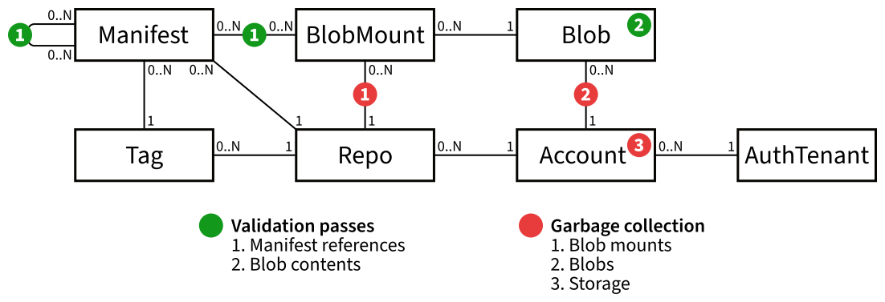

<!--
SPDX-FileCopyrightText: 2025 SAP SE

SPDX-License-Identifier: Apache-2.0
-->

# Keppel Operator Guide

In this document:

- [Terminology and data model](#terminology-and-data-model)
  - [Validation and garbage collection](#validation-and-garbage-collection)
- [Building and running Keppel](#building-and-running-keppel)
  - [Drivers](#drivers)
  - [Configuration options](#configuration-options)
  - [API server: Domain remapping support](#api-server-domain-remapping-support)
- [Prometheus metrics](#prometheus-metrics)

In other documents:

- [Supported drivers](./drivers/)

## Terminology and data model

This document assumes that you have already read and understood the [general README](../README.md). If not, start
reading there.

As outlined in the general README, Keppel stores data in **accounts** (each of which is tied to exactly one backing
storage) that are associated with **auth tenants** that control access to them.

Accounts are structured into **repositories**. Each repository contains any number of blobs, manifests and tags:

- **Manifests** collect a number of references to other manifests and blobs plus some metadata. Keppel parses manifests
  before storing them, so users are limited to the manifest formats supported by Keppel. Those supported formats are
  [Docker images and image lists](https://docs.docker.com/registry/spec/manifest-v2-2/), [OCI image
  manifests](https://github.com/opencontainers/image-spec/blob/master/image-index.md) and [OCI image
  indexes](https://github.com/opencontainers/image-spec/blob/master/image-index.md). Manifests are identified by their
  SHA-256 digest.

- **Blobs** are binary objects with arbitrary contents. Keppel does not inspect blobs' contents, but because only blobs
  referenced by manifests can be stored long-term (all blobs without a manifest reference are garbage-collected, see
  below), only blob types supported by the aforementioned manifest formats will be seen in practice. Those are mostly
  image layers and image configurations. Blobs, like manifests, are identified by their SHA-256 digest.

- **Tags** are named references to manifests (similar to how Git tags are just nice names for Git commits).

For example, consider the following image reference appearing in a Docker command:

```bash
$ docker pull keppel.example.com/os-images/debian:jessie-slim
```

This is referring to the tag `jessie-slim` within the repository `debian` in the Keppel account `os-images`. The Docker
client (as well as the OCI Distribution API spec) would consider the repository to be `os-images/debian` in this case
since they don't know about Keppel accounts. In general, the Keppel account name is always the first part of
the repository name, up to the first slash. In Keppel, we usually refer to `debian` as the "repository name" and
`os-images/debian` as the "full repository name".

Multiple Keppel deployments can be set up as **peers** of each other, which enables users to setup replication between
accounts of the same name on multiple peers. For example, if `keppel-1.example.com` and `keppel-2.example.com` are peers
of each other, and the account `library` is set up as a primary account on `keppel-1.example.com` and a replica of that
primary account on `keppel-2.example.com`, then the following will work:

```bash
$ docker push keppel-1.example.com/library/myimage:mytag
$ docker pull keppel-2.example.com/library/myimage:mytag # same image!
```

When Keppel instances are configured as peers for each other, they will regularly check in with each other to issue each
other service user passwords. This process is known as **peering**.

There's one more thing you need to know: In Keppel's data model, blobs are actually not sorted into repositories, but
one level higher, into accounts. This allows us to deduplicate blobs that are referenced by multiple repositories in the
same account. To model which repositories contain which blobs, Keppel's data model has an additional object, the **blob
mount**. A blob mount connects a blob stored within an account with a repo within that account where that blob can be
accessed by the user. All in all, our data model looks like this: (Peers and quotas are not pictured for simplicity's
sake.)



### Validation and garbage collection

The chart above indicates various recurring tasks that need to be run on a regular basis. Keppel has a dedicated server
component, the **janitor**, which is responsible for performing these recurring tasks. The table below explains all the
tasks performed by the janitor.

| Task | Explanation |
| ---- | ----------- |
|  Manifest reference validation | Takes a manifest, parses its contents and check that the references to other manifests and blobs included therein are correctly entered in the database.<br><br>*Rhythm:* every 24 hours (per manifest)<br>*Clock:* database field `manifests.next_validation_at`<br>*Signal:* Prometheus counter `keppel_manifest_validations`<br>*Success signal:* database field `manifests.validation_error_message` cleared<br>*Failure signal:* database field `manifests.validation_error_message` filled |
|  Blob content validation | Takes a blob and computes the digest of its contents to see if it checks the digest stored in the database.<br><br>*Rhythm:* every 7 days (per blob)<br>*Clock:* database field `blobs.next_validation_at`<br>*Success signal:* Prometheus counter `keppel_blob_validations`<br>*Success signal:* database field `blobs.validation_error_message` cleared<br>*Failure signal:* Prometheus counter `keppel_blob_validations`<br>*Failure signal:* database field `blobs.validation_error_message` filled |
|  Blob mount GC | Takes a repository and unmounts all blobs that are not referenced by any manifest in this repository.<br><br>*Rhythm:* every hour (per repository), **BUT** not while any manifests in the repository fail validation<br>*Clock:* database field `repos.next_blob_mount_sweep_at`<br>*Signal:* Prometheus counter `keppel_mount_sweeps` |
|  Blob GC | Takes an account and deletes all blobs that are not mounted into any repository.<br><br>*Rhythm:* every hour (per account)<br>*Clock:* database field `accounts.next_blob_sweep_at`<br>*Signal:* Prometheus counter `keppel_blob_sweeps` |
|  Storage GC | Takes an account's backing storage and deletes all blobs and manifests in it that are not referenced in the database.<br><br>*Rhythm:* every 6 hours (per account)<br>*Clock:* database field `accounts.next_storage_sweep_at`<br>*Signal:* Prometheus counter `keppel_storage_sweeps` |
| Tag/manifest sync | Takes a repo in a replica account and deletes all manifests stored in it that have been deleted on the primary account. Also moves all replicated tags to point to the same manifest as on the primary account, replicating new manifests as necessary.<br><br>*Rhythm:* every hour (per repository)<br>*Clock:* database field `repos.next_manifest_sync_at`<br>*Signal:* Prometheus counter `keppel_manifest_syncs` |
| Image GC | Evaluates all GC policies configured by users on their accounts (see respective section in API spec for details).<br><br>*Rhythm:* every hour (per repository)<br>*Clock:* database field `repos.next_gc_at`<br>*Signal:* Prometheus counter `keppel_image_garbage_collections` |
| Cleanup of abandoned uploads | Takes a blob upload that is still technically in progress, but has not been touched by the user in 24 hours, and removes it from the database and backing storage.<br><br>*Rhythm:* 24 hours after upload was last touched (per upload)<br>*Clock:* database field `uploads.updated_at`<br>*Signal:* Prometheus counter `keppel_abandoned_upload_cleanups` |
| Account federation announcement | Takes an account and announces its existence to the federation driver. This is a no-op for the simpler federation driver implementations. For federation drivers that track account existence in a global-scoped storage, this validation ensures that all existing accounts are correctly tracked there. This is most useful when switching to a different federation driver and populating its storage.<br><br>*Rhythm:* every hour (per account)<br>*Clock:* database field `accounts.next_federation_announcement_at`<br>*Signal:* Prometheus counter `keppel_account_federation_announcements` |
| Security scanning | Only if a Trivy instance has been configured (see below). Takes a manifest and updates its vulnerability status according to the result of its security scan in Trivy.<br><br>*Rhythm:* every hour (per manifest)<br>*Clock:* database field `trivy_security_info.next_check_at`<br>*Signal:* Prometheus counter `keppel_trivy_security_status_checks` |

In this table:

- The **rhythm** is how often each task is executed.
- The **clock** is a timestamp field in the database that indicates when the task was last run (or will next run) for a
  particular manifest/repository/account. You can manipulate this field if you want to have a task re-run ahead of
  schedule.
- **Success signals** indicate that a task completed successfully.
- **Failure signals** indicate that a task failed.

Most garbage collection (GC) passes run in a mark-and-sweep pattern: When an unreferenced object is encountered for the
first time, it is only marked for deletion. It will be deleted when the next run still finds it unreferenced. This is to
avoid inconsistencies arising from write operations running in parallel with a GC pass.

Note that the GC passes chain together: When a manifest is deleted, the blob mount GC will clean up its blob mounts.
Then the blob GC will clean up the blobs. Both steps take about 2-3 hours because of the hourly GC rhythm and the
mark-and-sweep pattern. Therefore it takes between 4-6 hours from a manifest's deletion to the deletion of the blobs on
the backing storage. Add another 1-2 hours if you're deleting on a primary account and want to see blobs deleted in the
replica account.

In the SAP Converged Cloud deployments of Keppel, we alert on all the `keppel_...{task_outcome="failure"}` metrics to be notified when
any of these tasks are failing. We also use [postgres\_exporter](https://github.com/wrouesnel/postgres_exporter) custom
metrics to track the **clock** database fields as Prometheus metrics and alert when these get way too old to be notified
when the tasks are not running at all for some reason. See
[here](https://github.com/sapcc/helm-charts/blob/master/openstack/keppel/values.yaml) under `customMetrics` and
[here](https://github.com/sapcc/helm-charts/blob/master/openstack/keppel/alerts/openstack/janitor.alerts) for details.

## Building and running Keppel

Build Keppel with `make`, install with `make install` or `docker build`. This is the same as in the general README,
since the server and client components are all combined in one single binary. For a complete Keppel deployment, you need
to run:

- as many instances of `keppel server api` as you want,
- exactly one instance of `keppel server janitor`,
- optionally, one instance of `keppel server liquidapi` to enable integration with [Limes](https://github.com/sapcc/limes) if desired,
- optionally, one instance of `keppel server healthmonitor`,
- optionally, one instance of `keppel server anycastmonitor`.

All commands take configuration from environment variables, as listed in the [Configuration options](#configuration-options) section below.

### Drivers

Keppel provides several interfaces for pluggable **drivers**, and it is up to you to choose the appropriate drivers for
your environment:

- The **auth driver** accesses an external auth service and translates users and permissions in that auth service into
  permissions in Keppel. The choice of auth driver therefore defines which auth tenants exist.

- The **storage driver** accesses an external storage service and chooses the backing storage for each Keppel account.
  The choice of storage driver is usually linked to the choice of auth driver because the auth driver needs to set up
  permissions for Keppel to access the storage service.

- The **federation driver** decides which account names a given user and auth tenant is allowed to claim. In a
  single-region deployment, the "trivial" federation driver allows everyone to claim any unused name. In a multi-region
  deployment, an appropriate federation driver could access a central service that manages account name claims. As for
  storage drivers, the choice of federation driver may be linked to the choice of auth driver.

- The **rate limit driver** decides how many pull/push operations can be executed per time unit for a given account.
  This driver is optional. If no rate limit driver is configured, rate limiting will not be enabled. As for storage
  drivers, the choice of rate limit driver may be linked to the choice of auth driver.

- The **inbound cache driver** adds a caching strategy to manifest pulls from external registries. The simplest
  implementation is the "trivial" inbound cache driver, which does not cache anything. Every access is a cache miss and
  goes through to the external registry.

- The **account management driver** provides an interface for receiving account configuration from an external source,
  like a configuration file or an external auth service or customer database.

### Configuration options

All commands take configuration from environment variables. To choose drivers, refer to the [documentation for drivers](./drivers/) and fill the respective `KEPPEL_DRIVER_` environment variable as described in the driver's documentation.

The components referenced in the table below are:

- **api** = `keppel server api`
- **janitor** = `keppel server janitor`
- **liquidapi** = `keppel server liquidapi`
- **healthmonitor** = `keppel server healthmonitor`
- **trivy** = `keppel server trivy` (also influences api and janitor)

| Name | Default | Relevant for components | Description |
| ---- | ------- | ----------------------- | ----------- |
| `KEPPEL_ANYCAST_ISSUER_KEY` | *(required if `KEPPEL_API_ANYCAST_FQDN` is set)* | api | Like `KEPPEL_ISSUER_KEY`, but used to sign tokens for anycast-style endpoints. Must be the same for all keppel-api instances sharing the same anycast domain name. |
| `KEPPEL_ANYCAST_PREVIOUS_ISSUER_KEY` | *(optional)* | api | The previous `KEPPEL_ANYCAST_ISSUER_KEY`. If given, anycast tokens signed with this key will still be accepted, enabling key rotation without disrupting pre-existing tokens. |
| `KEPPEL_API_ANYCAST_FQDN` | *(optional)* | api | Full domain name where users reach any keppel-api in this peer group, usually via anycast. Requests for accounts not held locally are reverse-proxied to the correct peer. Limited to anonymous authorization; cannot be used for pushing. |
| `KEPPEL_API_LISTEN_ADDRESS` | `:8080` | api | Listen address for the HTTP server. |
| `KEPPEL_API_PUBLIC_FQDN` | *(required)* | api, janitor | Full domain name where users reach keppel-api. |
| `KEPPEL_AUDIT_RABBITMQ_HOSTNAME` | `localhost` | api, janitor | Hostname of the RabbitMQ server. |
| `KEPPEL_AUDIT_RABBITMQ_PASSWORD` | `guest` | api, janitor | Password for the RabbitMQ user. |
| `KEPPEL_AUDIT_RABBITMQ_PORT` | `5672` | api, janitor | Port number for the RabbitMQ connection. |
| `KEPPEL_AUDIT_RABBITMQ_QUEUE_NAME` | *(required to enable audit trail)* | api, janitor | Name of the queue that will hold audit events, published to the default exchange. If not set, audit events are only written to the debug log. |
| `KEPPEL_AUDIT_RABBITMQ_USERNAME` | `guest` | api, janitor | RabbitMQ username. |
| `KEPPEL_DB_CONNECTION_OPTIONS` | *(optional)* | api, janitor | Additional database connection options. |
| `KEPPEL_DB_HOSTNAME` | `localhost` | api, janitor | Hostname of the PostgreSQL server. |
| `KEPPEL_DB_NAME` | `keppel` | api, janitor | Name of the database. |
| `KEPPEL_DB_PASSWORD` | *(optional)* | api, janitor | Password for the database user. |
| `KEPPEL_DB_PORT` | `5432` | api, janitor | Port on which the PostgreSQL service is running. |
| `KEPPEL_DB_USERNAME` | `postgres` | api, janitor | Username for the database connection. |
| `KEPPEL_DEBUG` | *(optional)* | *all* | Enable debug logging. |
| `KEPPEL_DRIVER_ACCOUNT_MANAGEMENT` | *(required)* | janitor | Configuration for an account management driver. Use `{"type":"trivial"}` if you don't need managed accounts. |
| `KEPPEL_DRIVER_AUTH` | *(required)* | api, janitor, liquidapi | Configuration for an auth driver. |
| `KEPPEL_DRIVER_FEDERATION` | *(required)* | api, janitor | Configuration for a federation driver. Use `{"type":"trivial"}` for single-region deployments. |
| `KEPPEL_DRIVER_INBOUND_CACHE` | *(required)* | api, janitor | Configuration for an inbound cache driver. Use `{"type":"trivial"}` to disable caching. |
| `KEPPEL_DRIVER_RATELIMIT` | *(optional)* | api | Configuration for a rate limit driver. Leave empty to disable rate limiting. |
| `KEPPEL_DRIVER_STORAGE` | *(required)* | api, janitor, liquidapi | Configuration for a storage driver. |
| `KEPPEL_ENABLE_HEADER_REFLECTOR` | *(optional)* | api | If `true`, enables the `/debug/reflect-headers` endpoint that echoes incoming request headers. Useful for debugging; should be disabled in production. |
| `KEPPEL_GUI_URI` | *(optional)* | api | If set, GET requests from web browsers to repository-like URLs are redirected here. May contain `%ACCOUNT_NAME%`, `%REPO_NAME%` and `%AUTH_TENANT_ID%` placeholders. Redirect only occurs if the repository allows anonymous pulling. |
| `KEPPEL_ISSUER_KEY` | *(required)* | api, janitor | Private key (PEM format or path to PEM file) used to sign auth tokens for Docker clients. Only ed25519 keys are supported. Generate with `openssl genpkey -algorithm ed25519 -out privkey.pem`. |
| `KEPPEL_JANITOR_LISTEN_ADDRESS` | `:8080` | janitor | Listen address for the HTTP server (exposes Prometheus metrics only). |
| `KEPPEL_LIQUIDAPI_LISTEN_ADDRESS` | `:8080` | liquidapi | Listen address for the HTTP server. |
| `KEPPEL_PEERS` | *(optional)* | api | JSON array describing peer keppel-api instances available for replication and pull delegation. See format below. |
| `KEPPEL_PREVIOUS_ISSUER_KEY` | *(optional)* | api, janitor | The previous `KEPPEL_ISSUER_KEY`. If given, tokens signed with this key are still accepted, enabling key rotation without disrupting pre-existing tokens. |
| `KEPPEL_REDIS_DB_NUM` | `0` | api | Redis database number. |
| `KEPPEL_REDIS_ENABLE` | *(required if `KEPPEL_DRIVER_RATELIMIT` is set)* | api | Enable Redis as ephemeral storage for compatible auth and rate limit drivers. |
| `KEPPEL_REDIS_HOSTNAME` | `localhost` | api | Hostname of the Redis server. |
| `KEPPEL_REDIS_PASSWORD` | *(optional)* | api | Password for Redis authentication. |
| `KEPPEL_REDIS_PORT` | `6379` | api | Port on which the Redis server is running. |
| `KEPPEL_TRACK_BYTES_QUOTA` | `false` | api, liquidapi | Whether bytes quota (capacity) should be tracked. |
| `KEPPEL_TRIVY_ADDITIONAL_PULLABLE_REPOS` | *(optional)* | api, janitor, trivy | Additional repository scopes added to tokens issued by the API and janitor, allowing Trivy components to pull their DB OCI images. |
| `KEPPEL_TRIVY_DB_MIRROR_PREFIX` | *(required)* | trivy | Prefix under which Trivy can find its database (may be a mirror or `ghcr.io`). |
| `KEPPEL_TRIVY_LISTEN_ADDRESS` | `:8080` | trivy | Listen address for the HTTP server. |
| `KEPPEL_TRIVY_TOKEN` | *(required)* | api, janitor, trivy | Static secret used by the Keppel API and janitor to authenticate against the Trivy server. |
| `KEPPEL_TRIVY_URL` | *(required)* | api, janitor | URL under which the Trivy proxy can be reached. |

#### `KEPPEL_PEERS` JSON format

Below you can see an example for the JSON format which `KEPPEL_PEERS` accepts.
`hostname` must be the FQDN where the other keppel instance is reachable.
`use_for_pull_delegation` controls whether that instance can be used for pull delegation. The field is optional and defaults to true if unset.

```json
[
  {
    "hostname": "keppel.example.com"
  },
  {
    "hostname": "keppel.example.org",
    "use_for_pull_delegation": false
  }
]
```

### Health monitor configuration

The health monitor takes some configuration options on the commandline:

```
$ keppel server healthmonitor <account-name> --listen <listen-address>
```

| Option | Default | Explanation |
| ------ | ------- | ----------- |
| `<account-name>` | *(required)* | The account where the test image is uploaded to and downloaded from. This account should be reserved for the health monitor and not be used by anyone else. |
| `<listen-address>` | :8080 | Listen address for HTTP server (only provides Prometheus metrics). |

Additionally, the environment variables must contain credentials for authenticating with the authentication method used
by the target Keppel API. (This is because the health monitor accesses the Keppel API to manage the configuration of its
account.) Refer to the documentation of your auth driver for what environment variables are expected.

After the initial setup phase (where the account is created and the test image is uploaded), the test image will be
downloaded and validated every 30 seconds. The result of the test is published as a Prometheus metric (see below). If
the test fails, a detailed error message is logged in stderr. If the setup phase fails, an error message is logged as
well and the program immediately exits with non-zero status.

### API server: Domain remapping support

Usually, Keppel exposes its APIs under the hostnames specified in `$KEPPEL_API_PUBLIC_FQDN` and `$KEPPEL_API_ANYCAST_FQDN`. However, if you wish, you can also configure your HTTPS reverse-proxy to serve the Keppel API on direct subdomains of these hostnames. In this case, the name of the subdomain will be interpreted as a Keppel account name, and the Registry API will be exposed on these subdomains without requiring the account name in the URL path. This is explained in more detail [in the API spec](./api-spec.md#domain-remapping).

## Prometheus metrics

All server components emit Prometheus metrics on the HTTP endpoint `/metrics`.

### API metrics

| Metric | Labels | Explanation |
| ------ | ------ | ----------- |
| `keppel_pulled_blobs`<br>`keppel_pushed_blobs`<br>`keppel_pulled_manifests`<br>`keppel_pushed_manifests`<br>`keppel_aborted_uploads` | `account`, `auth_tenant_id`, `method` | Counters for various API operations, as identified by the metric name. `keppel_aborted_uploads` counts blob uploads that ran into errors. Successful uploads are counted by `keppel_pushed_blobs` instead.<br><br>`method` is usually `registry-api`, but can also be `replication` (counting pulls on the primary account and pushes into replica accounts). |
| `keppel_failed_auditevent_publish`<br>`keppel_successful_auditevent_publish` | *none* | Counter for failed/successful deliveries of audit events (only if audit event sending is configured). |

### Janitor metrics

[See above](#validation-and-garbage-collection) for explanations of each operation.

| Metric | Labels | Explanation |
| ------ | ------ | ----------- |
| `keppel_blob_sweeps`<br>`keppel_storage_sweeps` | `task_outcome` set to either `failure` or `success` | Counters for account-level operations. One increment equals one account. |
| `keppel_blob_mount_sweeps`<br>`keppel_manifest_syncs` | | Counters for repository-level operations. One increment equals one repository. |
| `keppel_blob_validations` | `task_outcome` set to either `failure` or `success` | Counters for blob-level operations. One increment equals one blob. |
| `keppel_manifest_validations` | `task_outcome` set to either `failure` or `success` | Counters for manifest-level operations. One increment equals one manifest. |
| `keppel_abandoned_upload_cleanups` | `task_outcome` set to either `failure` or `success` | Counters for upload-level operations. One increment equals one upload. |

### Health monitor metrics

| Metric | Labels | Explanation |
| ------ | ------ | ----------- |
| `keppel_healthmonitor_result` | *none* | 0 if the last health check failed, 1 if it succeeded. |
